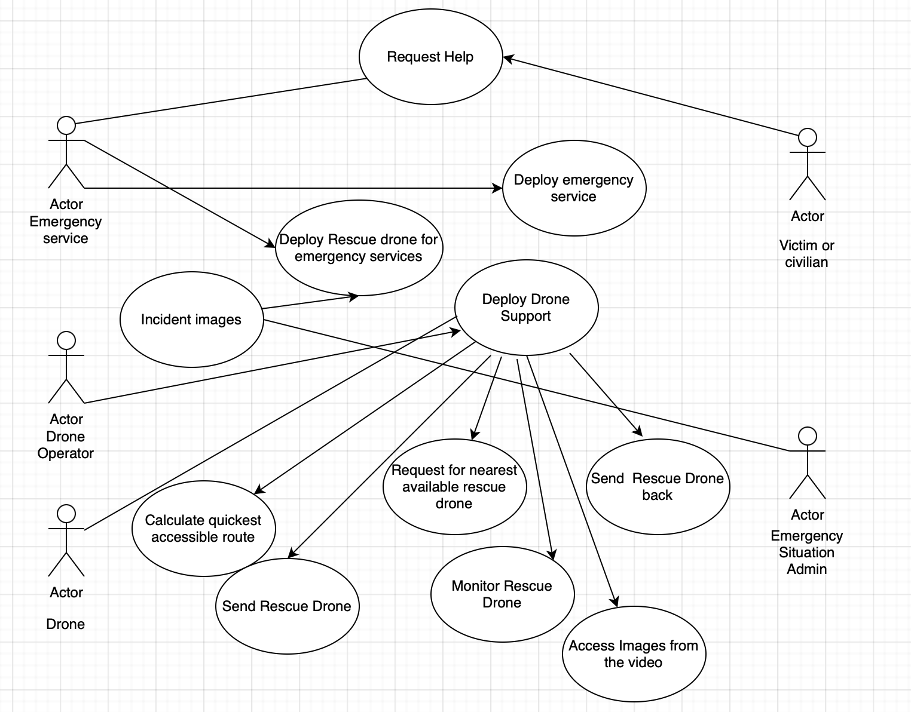
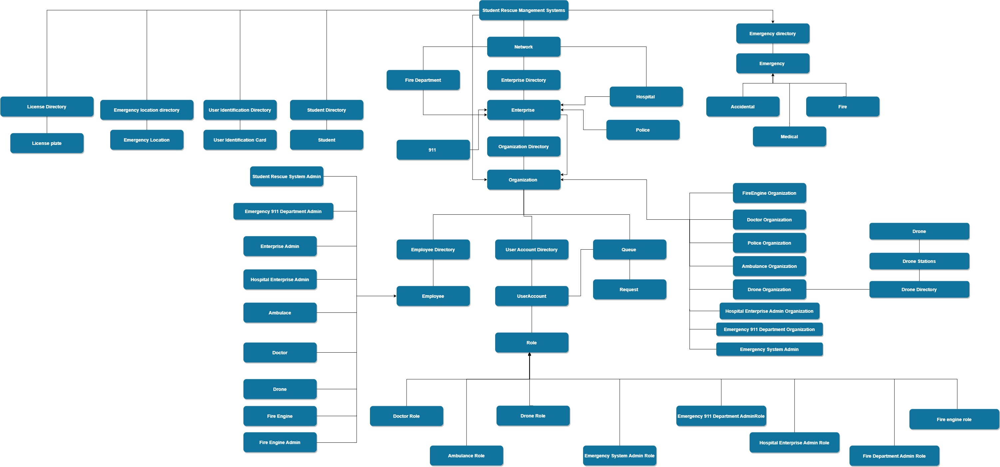

# Bavandla_Nikhilkumar_002658875
# Sripada Anuhya Sankeerthana_002654884
# Malipatel Haritha_002727622

### Final Project- Student Health Rescue Management System

### Project Glance is:

*The Java Swing Framework is the application's basis.*
*Utilization Purposes:*

1. It serves as a platform for individuals to get emergency treatment through drone to enhance the chance of 
survival for the victim in an emergency situation before the rescue team arrives.

2. After the victim or a civilian dials 911 a rescue drone will be deployed to the emergency situation

3. The emergency Rescue drone has all kind's of medical tools along with a camera and video system attached.

4. The Rescue Drone has medical tool kit with life saving technologies like Automated External Defibrillator (AED), Cardiopulmonary Resuscitation (CPR), 
Oxygen masks, medications, vaccines, insulin injections, and etc which are helpful in rescuing the victim in emergency situations before the rescue 
team arrives it also has an inbuilt camera and audio system to help explain how the help can be delivered to normal civilians.The average duration taken 
by “Rescue Drone” to reach the emergency spot  will be 1-2 minutes which enhances the chances of survival for the victim.

5. When the victim or a civilian dials 911 in case of an emergency. The “Student health rescue management system” representative attends the call. 
The place details are fetched by the admin.
 
6. The admin determines the nearest 911 Emergency Department, where he can route the call for quicker assistance.When the call is routed to the 
Emergency Department the admin determines the nearest Drone Station with respect to the emergency location and alerts the drone that is active.The 
active drone then determines the nearest available hospital which has the respective speciality to attend the victim problem.The drone alerts available 
doctor who is on call  of the hospital.

7. When the call is alerted, respective doctor is connected to the drone via camera and can view the live footage of the emergency location. When the 
respective doctor is connected the camera he can monitor the emergency situation and give instructions to the civilian at the emergency location to 
take required action.

8. When the drone alerts the hospital, it calculates the shortest path available for the ambulance to reach the emergency situation and sends this 
information to the hospital.Hospital management then finds an available ambulance and sends this details to the ambulance driver’s, which in turn 
guides the nearest route map for the ambulance to reach the destination.

9. If the emergency is of Accidental type, once the drone reaches the emergency spot. It can scan license plate of victim and send it to the 
“Police department”.The police department then runs through their registered database and finds the Victim’s details. The police fetches the 
emergency contact information of the victim and sends an alert to the contact about the accident.

10. Once the ambulance reaches emergency situation, the drone becomes available again and returns to its station.
## Sequence Diagrams

**Sequence flows**

## Class Diagram 

